# 🏃 Marathon Tracker

A clean, mobile-first web app for tracking marathon training — built for a sub-3:30 goal on **October 11, 2026**, with an auto-generated 16-week plan that builds to a 30 km peak and works around real-life interruptions (vacations, a surf trip).

No login required. Everything lives in your browser's **localStorage**. Optional Google Drive sync uses a thin Next.js backend (server-side OAuth) — there's no database. Deploys to Vercel.

> Design language: **Strava × Notion** — calm surfaces, data-dense cards, an orange race-day accent, and full dark mode.

> **Developers / AI agents:** start with [`docs/architecture.md`](docs/architecture.md) — the authoritative guide to the data model, state, flows, and conventions. This README is a user-facing overview and may lag behind newer features (multi-plan, the AI plan wizard, flexible periods, onboarding, Google Drive sync, English/Dutch i18n).

---

## Screenshots

| Dashboard | Dashboard (dark) |
| --- | --- |
| 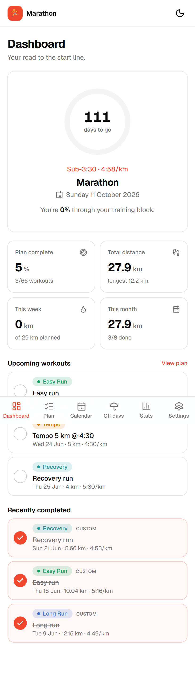 | 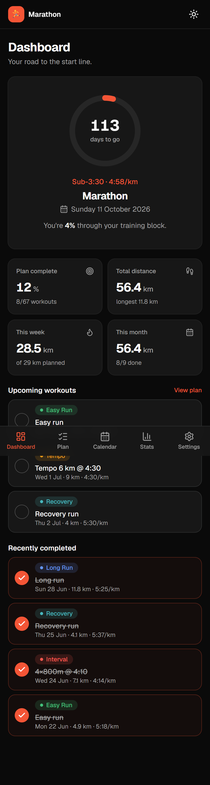 |

| Plan | Calendar | Stats |
| --- | --- | --- |
| 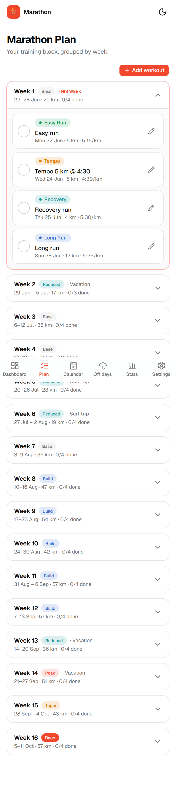 | 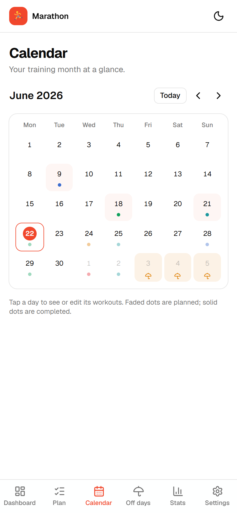 | 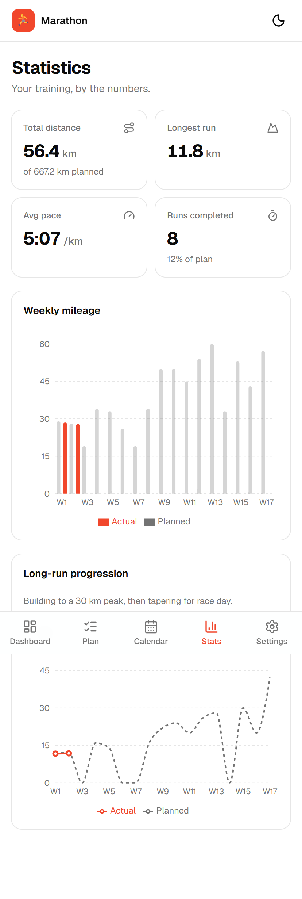 |

| Off days | Settings | Add-plan wizard |
| --- | --- | --- |
| 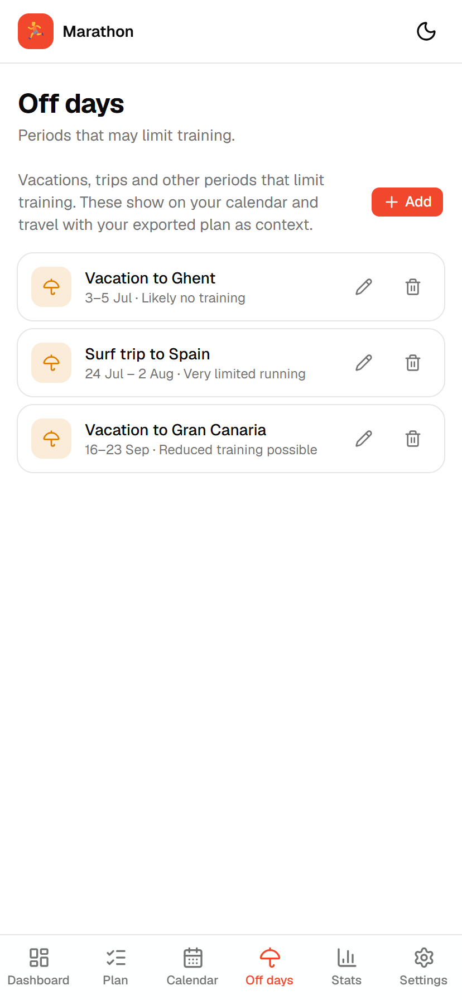 | 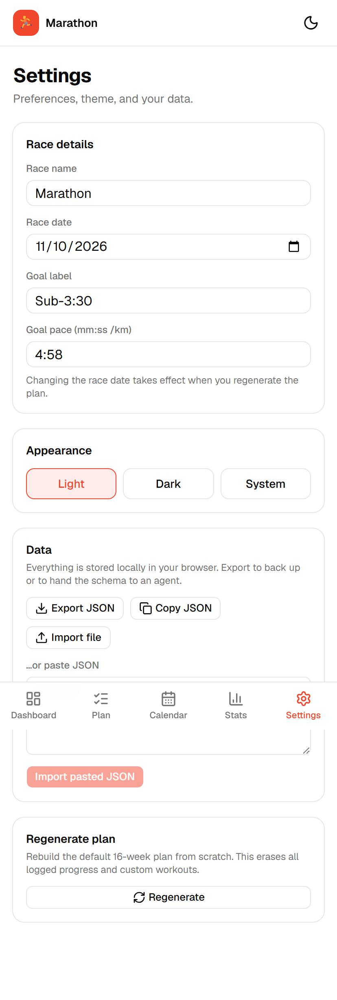 | 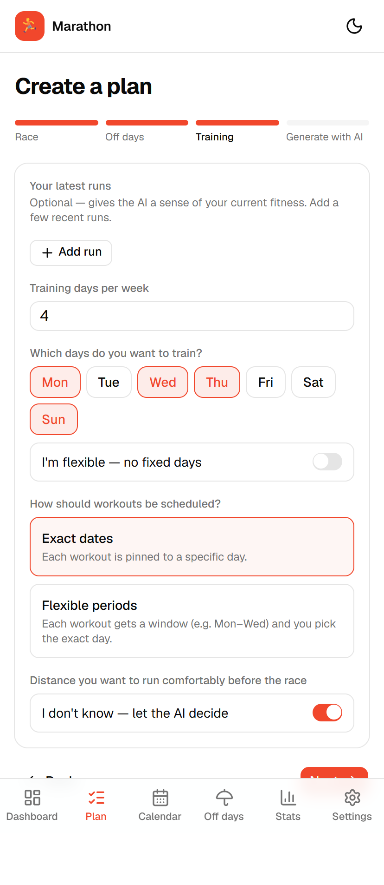 |

| Calendar (dark) | Stats (dark) | Dashboard (Dutch) |
| --- | --- | --- |
| 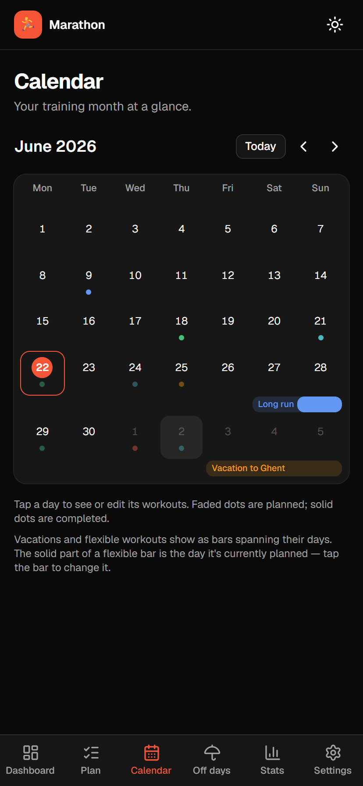 | 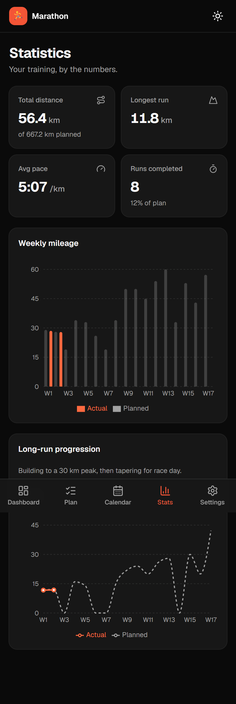 | 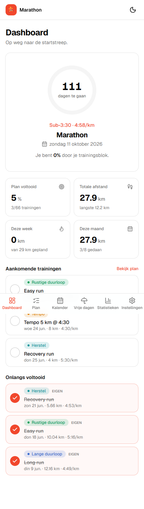 |

---

## Features

- **Dashboard** — countdown to race day, % through the training block, plan-completion %, weekly & monthly mileage (planned vs actual), upcoming and recently-completed workouts.
- **Marathon plan** — all training weeks, grouped and collapsible, with a phase badge (Base / Build / Peak / Taper / Race / Reduced) and special-period labels. Mark complete, edit, add custom workouts.
- **Workout tracking** — date, type (Easy / Tempo / Interval / Long / Recovery), planned & actual distance, planned & actual pace, duration. Actual pace is auto-derived from distance + time.
- **Statistics** — total distance, longest run, weighted average pace, runs completed, weekly mileage trend, and long-run progression (planned vs actual) charts.
- **Calendar** — monthly grid with colored workout dots (faded = planned, solid = completed); tap a day to view, edit, or add workouts.
- **Settings** — race details, theme (light/dark/system), and **export / import JSON** so you can hand the whole schema to an agent and re-import it. Regenerate the default plan anytime.

---

## The training plan

The plan is generated deterministically in [`lib/plan-generator.ts`](lib/plan-generator.ts) from today's week through race week. Each week follows the schedule **Mon easy · Wed quality · Thu easy · Sun long**, with paces derived from the sub-3:30 goal (race pace ~4:58/km) and slightly softened in the first three weeks for an injury return.

Long runs build with periodic cutbacks to a **30 km peak two weeks out**, then taper into the marathon. Special periods are encoded once in [`lib/date.ts`](lib/date.ts) and applied automatically:

| Period | Effect |
| --- | --- |
| Jul 3–5 (Vacation) | No training that weekend — long run dropped |
| Jul 24 – Aug 2 (Surf trip) | Limited — short optional jogs only |
| Sep 16–23 (Vacation) | Reduced volume |

Want a different plan? Either tweak the constants in `lib/plan-generator.ts` / `lib/date.ts` and redeploy, or export your JSON, edit it, and import it back from **Settings**.

---

## Tech stack

- [Next.js 16](https://nextjs.org) (App Router) + TypeScript
- [Tailwind CSS v4](https://tailwindcss.com) + [shadcn/ui](https://ui.shadcn.com) (Base UI primitives)
- [Zustand](https://github.com/pmndrs/zustand) with `persist` → localStorage
- [Recharts](https://recharts.org) for graphs · [date-fns](https://date-fns.org) for dates · [next-themes](https://github.com/pacocoursey/next-themes) for dark mode

---

## Getting started

```bash
npm install
npm run dev
```

Open [http://localhost:3000](http://localhost:3000). On first load the app generates your plan and saves it to localStorage.

```bash
npm run build   # production build (Vercel-ready)
npm run start   # serve the production build
```

### Deploy to Vercel

Push to a Git repo and import it in Vercel. The app is mostly client-side but serves a few server Route Handlers under `app/api/*` for Google Drive OAuth (running as Vercel Functions). The only (optional) configuration is the Google Drive sync env below — leave it unset and the app runs localStorage-only.

---

## Cloud sync setup (optional)

By default everything lives in your browser's localStorage. You can optionally connect a **Google account** to back up and sync your progress via **Google Drive**, using a **server-side OAuth 2.0 authorization-code flow** (refresh tokens kept in an encrypted session cookie — no database, no tokens in the browser). Data is stored in Drive's hidden **app-data folder**, invisible in your Drive and accessible only to this app.

Without the env below, the app still works fully (local only) and the Settings → Cloud sync card shows "not configured".

To enable it, create an OAuth client in the [Google Cloud Console](https://console.cloud.google.com/):

1. **Create a project** (or pick one).
2. **APIs & Services → Library →** enable **Google Drive API**.
3. **APIs & Services → OAuth consent screen:** choose **External**, add the scope `https://www.googleapis.com/auth/drive.appdata`, and **Publish the app (set it to "In production")**. ⚠️ Don't leave it in *Testing* — Google expires refresh tokens after **7 days** in Testing mode, which defeats staying signed in. `drive.appdata` is *sensitive* but not *restricted*, so publishing needs no formal verification; users just click past a one-time "unverified app" warning.
4. **APIs & Services → Credentials → Create credentials → OAuth client ID → Web application.** Under **Authorized redirect URIs** add:
   - `http://localhost:3000/api/auth/google/callback`
   - `https://<your-stable-domain>/api/auth/google/callback` (use a stable Vercel alias or custom domain — **not** a per-deployment hash URL).
5. Copy the **Client ID** and **Client secret** into `.env.local` (see `.env.local.example`):

   ```bash
   GOOGLE_CLIENT_ID=xxxxxxxx.apps.googleusercontent.com
   GOOGLE_CLIENT_SECRET=xxxxxxxx
   GOOGLE_REDIRECT_URI=http://localhost:3000/api/auth/google/callback
   SESSION_SECRET=$(openssl rand -base64 32)   # ≥32 chars; encrypts the session cookie
   ```

   For Vercel, add the same four variables under **Project → Settings → Environment Variables** (set `GOOGLE_REDIRECT_URI` to your production callback URL) and redeploy.

Then open **Settings → Cloud sync → Connect Google Drive** — you'll be redirected to Google and back.

- The **client secret** is confidential: it lives only in server env, never `NEXT_PUBLIC_`, never committed.
- The browser never sees an access/refresh token — it only calls same-origin `/api/*` routes; the server refreshes tokens transparently, so sessions survive page refreshes and the 1-hour token lifetime.
- Sync is **newest-wins**: it pulls on connect/refocus, auto-pushes a few seconds after each edit, and offers a manual **Sync now**. Disconnecting revokes the token server-side and clears the session, but keeps your local data.

### Troubleshooting: `redirect_uri_mismatch`

The `GOOGLE_REDIRECT_URI` (and the live callback URL) must **exactly** match an Authorized redirect URI on the OAuth client — scheme, host, and path. Per-deployment Vercel URLs (with a hash) change every deploy; register a stable alias/custom domain instead.

### Troubleshooting: signed out after ~7 days

Your consent screen is still in **Testing** mode (refresh tokens expire after 7 days). **Publish the app** in OAuth consent screen → Audience, then reconnect.

---

## Weather setup (optional)

Turn on **Settings → Weather** (or accept the onboarding prompt) to see per-day weather in the calendar and record the conditions of each logged run. It uses your **device location** (browser permission) and a server-side weather key — the key never reaches the browser.

To enable it:

1. Create an API key at [OpenWeatherMap](https://openweathermap.org/api/one-call-3) and subscribe to **"One Call by Call"** — **1000 calls/day are free**, but a **credit card is required even for the free tier**.
2. In your OWM dashboard, set a **"Calls per day" cap** to hard-stop at the free limit (the app caches aggressively, but this is your safety net).
3. Add the key to `.env.local` (and Vercel env), server-side only:

   ```bash
   OPENWEATHER_API_KEY=xxxxxxxx
   ```

Notes & limits:

- The key is **server-only** (never `NEXT_PUBLIC_`); the browser calls same-origin `/api/weather/*`. Without it, the Settings card shows "not configured".
- Responses are cached in `localStorage`; past days cache ~permanently, near-future briefly. The calendar fetches **one call per visible week**.
- **Hourly precision** (the logged finish time) resolves within ~48 h ahead or any past date; further-future planned runs only get the daily value.
- Weather uses your **current** location, so runs done while travelling/abroad will show your current-location weather.

---

## Support

This app is free and runs entirely in your browser, with no accounts, no ads, and no database. If it helps your training, you can leave a small tip. 💧

→ [buymeacoffee.com/milovanderpas](https://buymeacoffee.com/milovanderpas)

---

## Project structure

```
app/                 # Routes: dashboard (/), plan, calendar, stats, settings
components/
  ui/                # shadcn/ui primitives
  layout/            # nav, theme provider/toggle
  common/            # shared widgets (workout row, stat card, progress ring, …)
  dashboard|plan|calendar|stats|settings/   # per-page views
lib/
  types.ts           # domain models
  plan-generator.ts  # generateDefaultPlan() — the core logic
  date.ts            # week ranges + SPECIAL_PERIODS
  pace.ts            # pace parsing / formatting / derivation
  stats.ts           # derived statistics (pure functions)
  storage.ts         # export / import + migration hook
  google-drive.ts    # client-side Google Drive sync (GIS + Drive REST)
store/
  use-training-store.ts   # Zustand store + localStorage persistence
  use-sync-store.ts       # Google Drive sync state + auto-push
hooks/                # useHydrated, useStats
```

Statistics are **derived live** from your workouts rather than stored, so they never go stale — the only persisted state is the plan, your workouts, and preferences.
